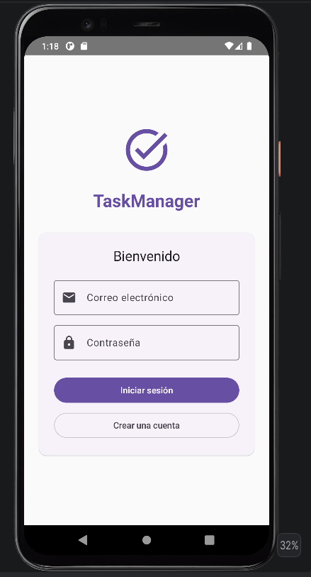
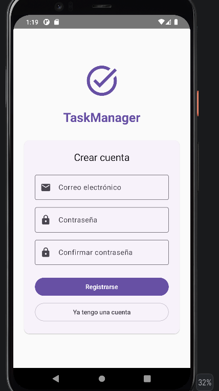
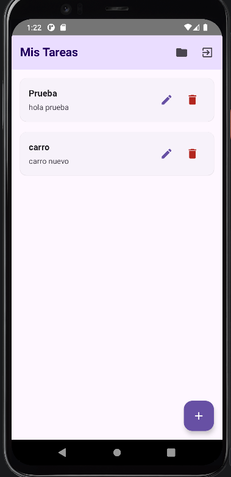
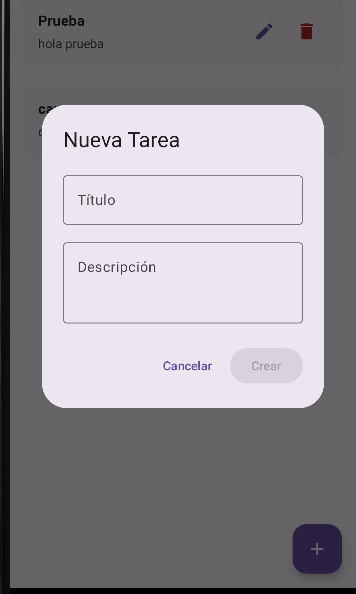
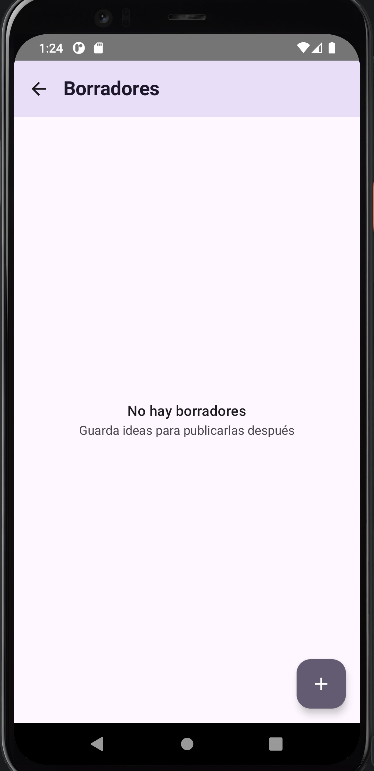
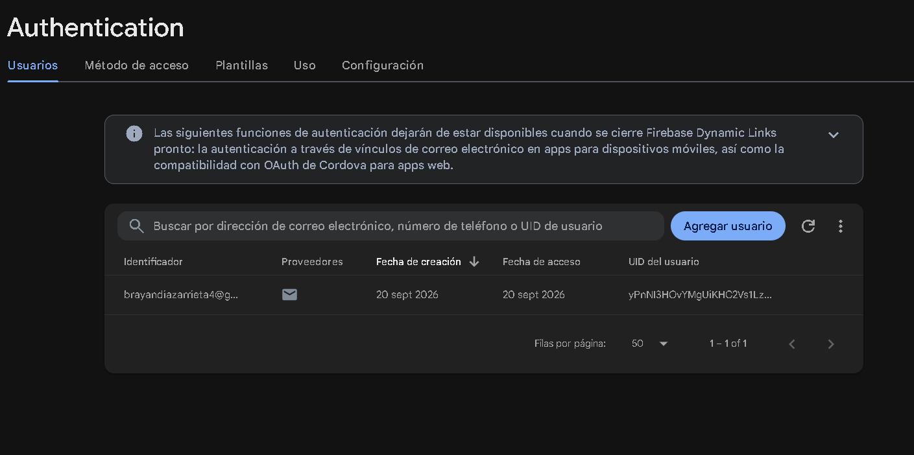
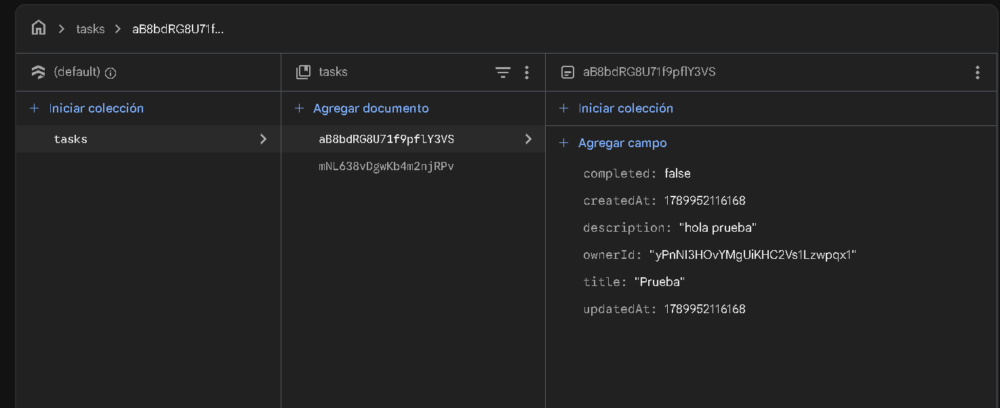

# TaskManager

Aplicación Android para la gestión personal de tareas, desarrollada con Kotlin y Jetpack Compose. El proyecto implementa autenticación de usuarios, administración de tareas mediante operaciones CRUD en Cloud Firestore y almacenamiento local de borradores utilizando Room.

## Autor

**Brayan Diaz Arrieta**

Trabajo realizado de manera individual.

## Descripción

TaskManager permite a cada usuario registrarse e iniciar sesión para administrar sus propias tareas.

La aplicación utiliza Firebase Authentication para gestionar los usuarios, Cloud Firestore para almacenar las tareas publicadas y Room para guardar borradores de forma local.

Las principales funcionalidades son:

* Registro de usuarios.
* Inicio y cierre de sesión.
* Persistencia de la sesión.
* Creación de tareas.
* Consulta de tareas.
* Edición de tareas.
* Eliminación de tareas.
* Creación de borradores locales.
* Consulta de borradores.
* Edición de borradores.
* Eliminación de borradores.
* Publicación de borradores en Firestore.
* Separación de la información mediante `ownerId`.
* Manejo de estados de carga, éxito, vacío y error.

## Tecnologías utilizadas

* **Kotlin**
* **Android Studio**
* **Jetpack Compose**
* **Material 3**
* **Navigation Compose**
* **Firebase Authentication**
* **Cloud Firestore**
* **Room**
* **Hilt**
* **Kotlin Coroutines**
* **StateFlow**
* **KSP**
* **Git y GitHub**

## Arquitectura

El proyecto utiliza la arquitectura **MVVM** con separación por capas.

```text
UI
│
├── Screens
├── Components
├── Navigation
└── UI State
        │
        ▼
ViewModel
        │
        ▼
Domain
│
├── Models
├── Repositories
└── Use Cases
        │
        ▼
Data
│
├── Remote
│   └── Firebase / Firestore
│
├── Local
│   └── Room
│
├── Mappers
└── Repository Implementations
```

También se utiliza **Hilt** para la inyección de dependencias.

### Flujo de datos

La interfaz no accede directamente a Firebase ni a Room. Las acciones de la interfaz son recibidas por los ViewModel, que ejecutan los casos de uso correspondientes. Estos utilizan las interfaces de repositorio y finalmente las implementaciones de la capa Data se encargan de acceder a las fuentes de datos.

## Estructura del proyecto

```text
com.example.taskmanager
│
├── data
│   ├── local
│   │   ├── dao
│   │   ├── database
│   │   └── entity
│   │
│   ├── remote
│   │   ├── api
│   │   └── dto
│   │
│   ├── mapper
│   └── repository
│
├── domain
│   ├── model
│   ├── repository
│   └── usecase
│       ├── auth
│       ├── task
│       └── draft
│
├── ui
│   ├── component
│   ├── navhost
│   ├── screen
│   ├── state
│   ├── theme
│   └── viewmodel
│
├── di
│
├── MainActivity.kt
└── MyApp.kt
```

## Funcionalidades

### Autenticación

La aplicación utiliza Firebase Authentication para:

* Registrar nuevos usuarios.
* Iniciar sesión mediante correo y contraseña.
* Obtener el usuario actualmente autenticado.
* Cerrar sesión.
* Mantener la sesión activa al volver a abrir la aplicación.

### Gestión de tareas

Las tareas se almacenan en Cloud Firestore dentro de la colección:

```text
tasks
```

Cada tarea maneja información como:

```text
id
ownerId
title
description
completed
createdAt
updatedAt
```

Las operaciones disponibles son:

* Crear tarea.
* Consultar tareas.
* Actualizar tarea.
* Eliminar tarea.

Las consultas de tareas utilizan el `ownerId` del usuario autenticado para mostrar únicamente sus registros.

### Borradores

Los borradores se almacenan localmente mediante Room en la tabla:

```text
task_drafts
```

Cada borrador contiene:

```text
id
ownerId
title
description
savedAt
```

Las operaciones disponibles son:

* Guardar borrador.
* Consultar borradores.
* Editar borrador.
* Eliminar borrador.
* Publicar borrador.

Cuando un borrador se publica, primero se intenta crear la tarea en Firestore. Si la operación es exitosa, el borrador se elimina de Room.

## Estados de la interfaz

La aplicación representa diferentes estados para informar al usuario sobre el proceso actual.

Entre ellos se encuentran:

* `Loading`
* `Success`
* `Empty`
* `Error`

Estos estados permiten mostrar información de carga, indicar cuando no existen registros y comunicar errores durante las operaciones.

## Configuración del proyecto

### Requisitos

Para ejecutar el proyecto se necesita:

* Android Studio.
* JDK compatible con la configuración del proyecto.
* Android SDK.
* Un dispositivo Android o emulador.
* Un proyecto configurado en Firebase.

### Configuración de Firebase

Para utilizar las funciones de autenticación y Firestore se debe configurar un proyecto en Firebase.

1. Crear un proyecto en Firebase.
2. Registrar la aplicación Android.
3. Utilizar el `applicationId` correspondiente al proyecto.
4. Descargar el archivo `google-services.json`.
5. Colocarlo dentro de la carpeta `app/`.
6. Activar Authentication mediante correo y contraseña.
7. Crear Cloud Firestore.
8. Configurar las reglas de seguridad correspondientes.
9. Ejecutar la aplicación desde Android Studio.

> El archivo `google-services.json` debe corresponder al proyecto de Firebase utilizado por la aplicación.

## Ejecución

1. Clonar el repositorio:

```bash
git clone [URL DEL REPOSITORIO]
```

2. Abrir el proyecto en Android Studio.

3. Esperar a que Gradle descargue y configure las dependencias.

4. Configurar Firebase siguiendo los pasos anteriores.

5. Seleccionar un dispositivo físico o emulador.

6. Ejecutar la aplicación desde Android Studio.

## Seguridad

La aplicación utiliza el `uid` proporcionado por Firebase Authentication como `ownerId`.

Este identificador permite asociar las tareas con el usuario autenticado y evitar que se mezclen los registros de diferentes usuarios.

Las contraseñas no se almacenan directamente en Firestore ni en Room.

## Capturas de pantalla

En esta sección se deben agregar las capturas de las principales pantallas de la aplicación.

### Inicio de sesión



### Registro



### Lista de tareas



### Crear o editar tarea



### Borradores




### Firebase Authenticacion



### Cloud Firestore



## Pruebas

Se realizaron pruebas sobre las principales funcionalidades de la aplicación:

* Registro de usuarios.
* Inicio de sesión.
* Cierre de sesión.
* Persistencia de sesión.
* Creación de tareas.
* Consulta de tareas.
* Actualización de tareas.
* Eliminación de tareas.
* Creación y gestión de borradores.
* Publicación de borradores.

La matriz de pruebas debe registrar los resultados obtenidos durante la ejecución de cada caso de prueba.

## Funcionalidades terminadas

* [x] Registro de usuarios.
* [x] Inicio de sesión.
* [x] Persistencia de sesión.
* [x] Cierre de sesión.
* [x] Crear tareas.
* [x] Consultar tareas.
* [x] Actualizar tareas.
* [x] Eliminar tareas.
* [x] Crear borradores.
* [x] Consultar borradores.
* [x] Actualizar borradores.
* [x] Eliminar borradores.
* [x] Publicar borradores.
* [x] Estados de carga.
* [x] Estados vacíos.
* [x] Manejo de errores.
* [x] Arquitectura MVVM.
* [x] Inyección de dependencias con Hilt.
* [x] Persistencia local con Room.

## Errores conocidos

No se reportan errores funcionales conocidos en la versión entregada.

La aplicación requiere una configuración correcta de Firebase para realizar las operaciones de autenticación y almacenamiento remoto.

## Control de versiones

El proyecto utiliza Git y GitHub para el control de versiones.

## Autor

**Brayan Diaz Arrieta**

Proyecto académico desarrollado de manera individual para el taller de formación sobre aplicaciones Android con Firebase, Room y arquitectura MVVM.